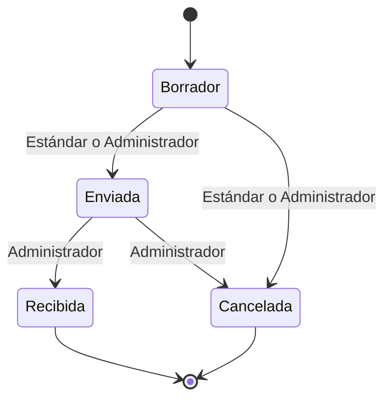

# Máquina de estados de la orden de compra

SaveStock es un inventario para negocios pequeños. La entidad central del módulo de inventario es la
**orden de compra**: el pedido que el negocio le hace a un proveedor para reponer su stock. Cada orden
pasa por un ciclo de vida fijo, y el sistema solo deja hacer los cambios de estado que están en la
tabla de abajo.

## Estados (RF-NEG-03)

| Estado | Qué significa |
|---|---|
| **Borrador** | Estado inicial. La orden se está preparando y todavía no se mandó al proveedor. |
| **Enviada** | Se mandó al proveedor y se espera la mercancía. |
| **Recibida** | Llegó la mercancía y repuso el stock. Estado terminal. |
| **Cancelada** | Se anuló antes de recibirse. Estado terminal. |

Toda orden nueva empieza en **Borrador**.

## Transiciones permitidas (RD-04)

| Desde | Hacia | Quién la ejecuta | Condición |
|---|---|---|---|
| Borrador | Enviada | Estándar o Administrador | La orden tiene un proveedor indicado. |
| Enviada | Recibida | Administrador | Llegó la mercancía. |
| Borrador | Cancelada | Estándar o Administrador | Ninguna: el borrador todavía no se mandó al proveedor. |
| Enviada | Cancelada | Administrador | El proveedor no entrega la mercancía. |
| Cualquier otra combinación | — | — | Prohibida. El sistema la rechaza y el estado no cambia. |

Si quien la ejecuta no tiene el rol indicado, el sistema responde que no tiene permiso
(`Prohibido`). Si la transición no está en la tabla o no se cumple la condición, responde con un
error de validación. En los dos casos la orden queda exactamente como estaba.

## Transición prohibida explícita (RF-NEG-04)

| Desde | Hacia | Motivo |
|---|---|---|
| Recibida | Borrador | La mercancía ya entró al stock y la orden no se puede volver a editar. |

Ya queda rechazada por no estar en la tabla de transiciones permitidas, pero se declara aparte en el
código para que el motivo quede escrito y el mensaje de error lo explique.

## Estados terminales (RF-NEG-05)

**Recibida** y **Cancelada**. No sale ninguna transición de ellos: cualquier intento de cambiar una
orden en uno de estos estados se rechaza y el estado no cambia.

## Dónde está en el código

El punto único de estados y transiciones es `MaquinaEstadosOrdenCompra`. Ningún otro lugar del
sistema valida estados.

| Qué | Dónde |
|---|---|
| Los estados (declarados una sola vez) | [`src/SaveStock.Inventario/OrdenesDeCompra/EstadoOrdenCompra.cs`](../src/SaveStock.Inventario/OrdenesDeCompra/EstadoOrdenCompra.cs) |
| La tabla de transiciones permitidas (`Transiciones`) | [`src/SaveStock.Inventario/OrdenesDeCompra/MaquinaEstadosOrdenCompra.cs`](../src/SaveStock.Inventario/OrdenesDeCompra/MaquinaEstadosOrdenCompra.cs) |
| La transición prohibida explícita (`TransicionesProhibidasExplicitas`) | el mismo archivo |
| Los estados terminales (`EstadosTerminales`) | el mismo archivo |
| La consulta (`PuedeTransicionar`) y el único código que cambia el estado (`Aplicar`) | el mismo archivo |
| Cómo es una fila de la tabla (`Transicion`, `TransicionProhibida`) | [`src/SaveStock.Inventario/OrdenesDeCompra/Transicion.cs`](../src/SaveStock.Inventario/OrdenesDeCompra/Transicion.cs) |
| La entidad `OrdenDeCompra` (su `Estado` solo se cambia desde el módulo) | [`src/SaveStock.Inventario/OrdenesDeCompra/OrdenDeCompra.cs`](../src/SaveStock.Inventario/OrdenesDeCompra/OrdenDeCompra.cs) |
| La base del inventario (`datos/inventario.db`, tabla `OrdenesDeCompra`, estado guardado como texto) | [`src/SaveStock.Inventario/Datos/InventarioDbContext.cs`](../src/SaveStock.Inventario/Datos/InventarioDbContext.cs) |
| Creación de la base al iniciar | [`src/SaveStock.Inventario/Datos/InicializadorInventario.cs`](../src/SaveStock.Inventario/Datos/InicializadorInventario.cs) |
